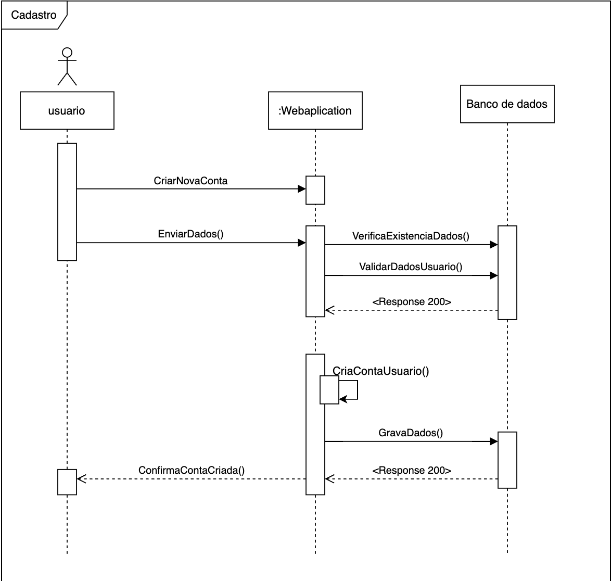
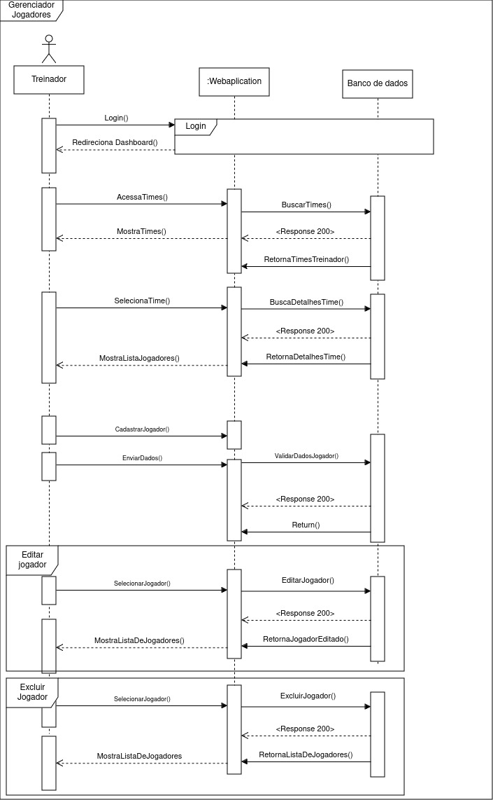
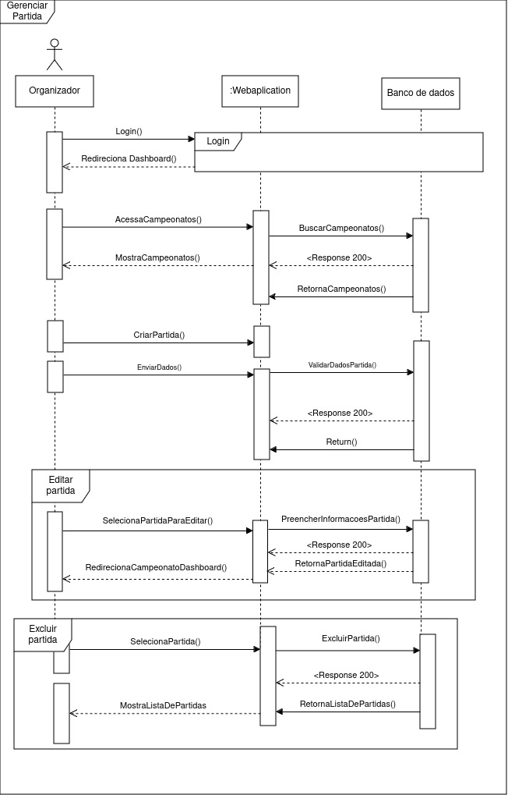
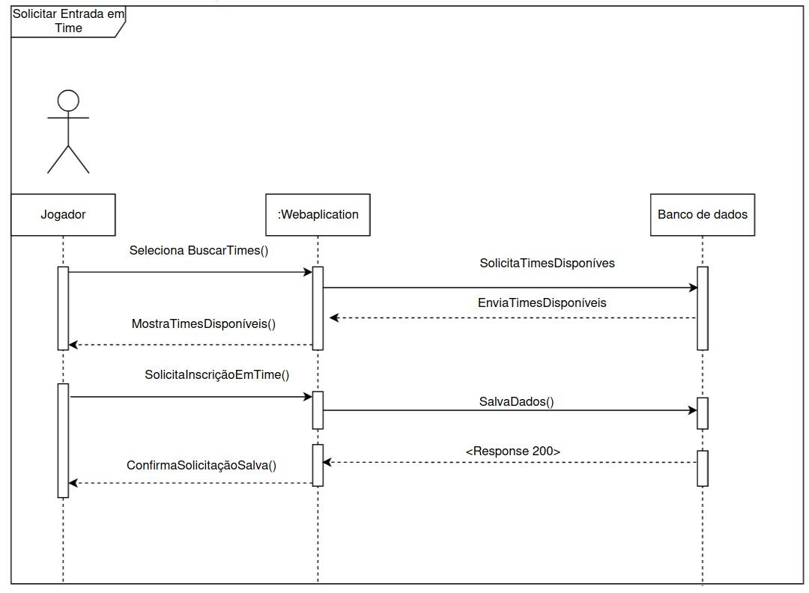
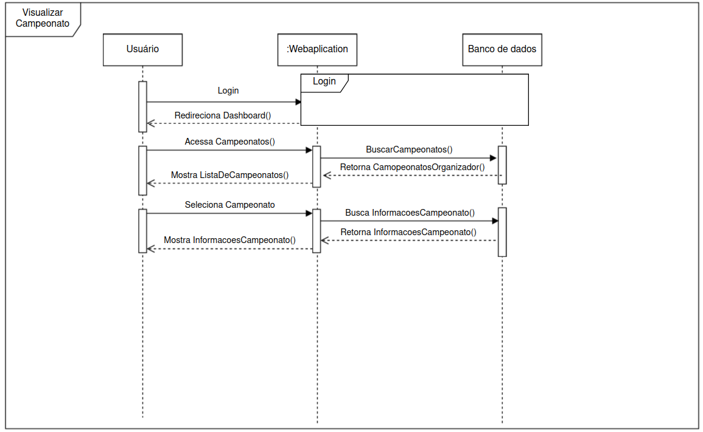

# Diagrama de Classe

## Introdução

## Metodologia

## Explicação do Diagrama de Sequência

## Diagramas

<!-- ####################### Sequência - Cadastro ####################### -->

Figura 1: Diagrama de Sequencia: Cadastro 

Autores: [Flávio Melo](https://github.com/flavioovatsug), [Oscar de Brito](https://github.com/OscarDeBrito) e [Fabrício](https://github.com/FabricioDeQueiroz) 

 

<!-- ####################### Sequência - Gerenciar Jogadores ####################### -->

Figura 2: Diagrama de Sequencia: Gerenciar Jogadores 

Autores: [Artur Jackson](https://github.com/artur-jack), [Caio Sulz](https://github.com/CaioSulz) 

 

<!-- ####################### Sequência - Gerenciar Partidas ####################### -->

Figura 3: Diagrama de Sequencia: Gerenciar Partidas 

Autores: [Flávio Melo](https://github.com/flavioovatsug), [Oscar de Brito](https://github.com/OscarDeBrito) e [Fabrício](https://github.com/FabricioDeQueiroz) 

Figura 4: Diagrama de Sequencia: Solicitar Entrada em Time 

Autores: [Yan Luca Viana](https://github.com/yan-luca) e [Gabriel Esteves](https://github.com/GabrielMEsteves) 

Figura 5: Diagrama de Sequencia: Visualizar Campeonato 

Autores: [Yan Luca Viana](https://github.com/yan-luca) e [Gabriel Esteves](https://github.com/GabrielMEsteves) 

## Conclusão

## Bibliografia

## Histórico de Versão

|Versão|Data|Descrição|Autor|Revisor| Detalhes da revisão |
|:----:|----|---------|-----|:-------:|-----| 
| 1.0 | 24/11/2024 | Criação do arquivo | [Flávio Melo](https://github.com/flavioovatsug) |  | |
| 1.1 | 24/11/2024 | Adição do Diagrama de sequencia: Cadastro | [Flávio Melo](https://github.com/flavioovatsug), [Oscar de Brito](https://github.com/OscarDeBrito) e [Fabricio](https://github.com/FabricioDeQueiroz) |  | |
| 1.2 | 24/11/2024 | Adição do Diagrama de Sequência: Gerenciar Jogadores | [Artur Jackson](https://github.com/artur-jack), [Caio Sulz](https://github.com/CaioSulz) |  | |
| 1.3 | 24/11/2024 | Adição do Diagrama de sequencia: Gerenciar Partidas | [Flávio Melo](https://github.com/flavioovatsug), [Oscar de Brito](https://github.com/OscarDeBrito) e [Fabrício](https://github.com/FabricioDeQueiroz) |  | |
| 1.4 | 26/11/2024 | Adição do Diagrama de sequencia: Gerenciar Partidas | [Yan Luca Viana](https://github.com/yan-luca) e [Gabriel Esteves](https://github.com/GabrielMEsteves)|  | |
| 1.5 | 26/11/2024 | Adição do Diagrama de sequencia: Visualizar Campeonato | [Yan Luca Viana](https://github.com/yan-luca) e [Gabriel Esteves](https://github.com/GabrielMEsteves)|  | |