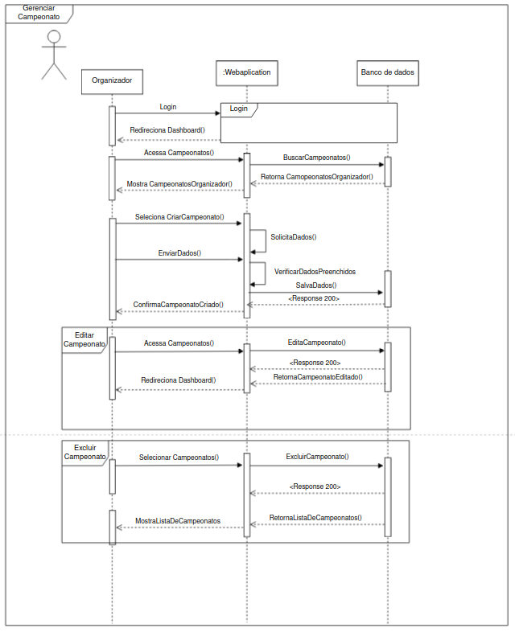
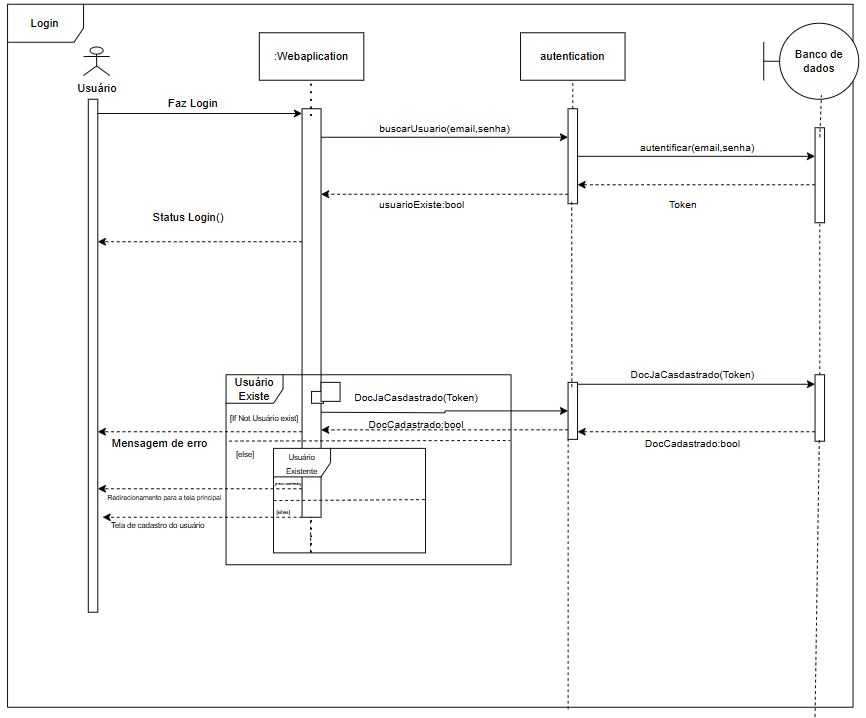
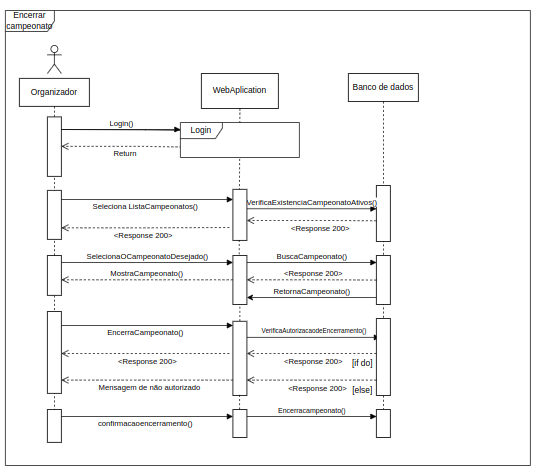

# Diagrama de Sequência

## Introdução

Os Diagramas de Sequência são artefatos da UML que representam a interação entre Objetos em um sistema, no nosso caso, no sistema web TorneioPro. Eles são usados para modelar a lógica de execução de um sistema, mostrando a ordem de chamadas entre os Objetos e as mensagens trocadas entre eles.

## Metodologia

A equipe optou por produzir Diagramas de Sequência da maioria das funcionalidades representadas no [Diagrama de Casos de Uso](<!-- #### LINK #### -->). A produção dos diagramas foi realizada de forma colaborativa no Discord, onde cada subgrupo ficou responsável por um representar uma funcionalidade. A produção dos Diagramas foi feita no software [draw.io](https://www.drawio.com/), que é uma ferramenta colaborativa online para criação de Diagramas.

## Explicação do Diagrama de Sequência

## Notação do Diagrama de Sequência

## Diagramas

<!-- ####################### Sequência - Cadastro ####################### -->

Figura 1: Diagrama de Sequencia: Cadastro 

Autores: [Flávio Melo](https://github.com/flavioovatsug), [Oscar de Brito](https://github.com/OscarDeBrito) e [Fabrício](https://github.com/FabricioDeQueiroz) 

 

<!-- ####################### Sequência - Gerenciar Jogadores ####################### -->

Figura 2: Diagrama de Sequencia: Gerenciar Jogadores 

Autores: [Artur Jackson](https://github.com/artur-jack), [Caio Sulz](https://github.com/CaioSulz) 

 

<!-- ####################### Sequência - Gerenciar Partidas ####################### -->

Figura 3: Diagrama de Sequencia: Gerenciar Partidas 

Autores: [Flávio Melo](https://github.com/flavioovatsug), [Oscar de Brito](https://github.com/OscarDeBrito) e [Fabrício](https://github.com/FabricioDeQueiroz) 

 

Figura 4: Diagrama de Sequencia: Solicitar Entrada em Time 

Autores: [Yan Luca Viana](https://github.com/yan-luca) e [Gabriel Esteves](https://github.com/GabrielMEsteves) 

  

Figura 5: Diagrama de Sequencia: Visualizar Campeonato 

Autores: [Yan Luca Viana](https://github.com/yan-luca) e [Gabriel Esteves](https://github.com/GabrielMEsteves) 

 

Figura 6: Diagrama de Sequencia: Gerenciar Campeonato 

Autores: [Yan Luca Viana](https://github.com/yan-luca),  [Gabriel Esteves](https://github.com/GabrielMEsteves) e [Italo Bruno](https://github.com/ItaloBrunoM) 

 

Figura 7: Diagrama de Sequencia: Login 

Autores: [Christian](https://github.com/crstyhs), [Ian Lucca](https://github.com/IanLucca12)  

 

Figura 8: Diagrama de Sequencia: Encerrar Campeonato 

Autores: [Christian](https://github.com/crstyhs), [Ian Lucca](https://github.com/IanLucca12) e [Harryson Campos](https://github.com/harry-cmartin) 

## Conclusão

## Bibliografia

> 1. Serrano, Milene. Arquitetura E Desenho de Software AULA - Modelagem - Diagrama de Sequência. Nov. 2024.
> 2. O que é um diagrama de sequência UML? - Lucidchart. https://www.lucidchart.com/pages/pt/o-que-e-diagrama-de-sequencia-uml (Acesso em 24 de novembro de 2024).
> 3. Curso de UML - Diagrama de Sequência UML - Exemplo Básico. YouTube. https://youtu.be/LeV6RO-6Tn4 (Acesso em 24 de novembro de 2024).

## Histórico de Versão

|Versão|Data|Descrição|Autor|Revisor| Detalhes da revisão |
|:----:|----|---------|-----|:-------:|-----| 
| 1.0 | 24/11/2024 | Criação do arquivo | [Flávio Melo](https://github.com/flavioovatsug) |  | |
| 1.1 | 24/11/2024 | Adição do Diagrama de sequencia: Cadastro | [Flávio Melo](https://github.com/flavioovatsug), [Oscar de Brito](https://github.com/OscarDeBrito) e [Fabrício](https://github.com/FabricioDeQueiroz) |  | |
| 1.2 | 24/11/2024 | Adição do Diagrama de Sequência: Gerenciar Jogadores | [Artur Jackson](https://github.com/artur-jack), [Caio Sulz](https://github.com/CaioSulz) |  | |
| 1.3 | 24/11/2024 | Adição do Diagrama de sequencia: Gerenciar Partidas | [Flávio Melo](https://github.com/flavioovatsug), [Oscar de Brito](https://github.com/OscarDeBrito) e [Fabrício](https://github.com/FabricioDeQueiroz) |  | |
| 1.4 | 26/11/2024 | Adição do Diagrama de sequencia: Gerenciar Partidas | [Yan Luca Viana](https://github.com/yan-luca) e [Gabriel Esteves](https://github.com/GabrielMEsteves)|  | |
| 1.5 | 26/11/2024 | Adição do Diagrama de sequencia: Visualizar Campeonato | [Yan Luca Viana](https://github.com/yan-luca) e [Gabriel Esteves](https://github.com/GabrielMEsteves)|  | |
| 1.6 | 26/11/2024 | Adição do Diagrama de sequencia: Gerenciar Campeonato | [Yan Luca Viana](https://github.com/yan-luca) , [Gabriel Esteves](https://github.com/GabrielMEsteves) e [Italo Bruno](https://github.com/ItaloBrunoM)|  | |
| 1.7 | 27/11/2024 | Adição da Introdução, Metodologia e Bibliografia | [Fabrício](https://github.com/FabricioDeQueiroz), [Flávio Melo](https://github.com/flavioovatsug) e [Oscar de Brito](https://github.com/OscarDeBrito) |  | |
| 1.8 | 27/11/2024 | Adição do Diagrama de sequencia: Encerrar Campeonato e Login | [Christian](https://github.com/crstyhs) |  | |