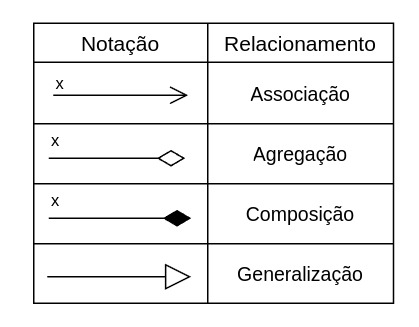

# Diagrama de Atividades

## Introdução

Um diagrama de atividade é uma representação gráfica que descreve de forma clara e detalhada o fluxo de atividades ou processos em um sistema, auxiliando no entendimento e na análise de sua lógica operacional. Ele é particularmente útil para visualizar a sequência de etapas necessárias para alcançar um objetivo, seja no contexto de um processo de negócios, um sistema computacional ou uma interação entre usuários e sistemas.

Amplamente utilizado em projetos de desenvolvimento de software, especialmente no contexto da UML (Unified Modeling Language), o diagrama de atividade é uma ferramenta poderosa para modelar comportamentos dinâmicos e complexos. Ele permite representar não apenas a ordem das ações, mas também os pontos de decisão, paralelismos e sincronia, bem como as condições que regem a transição entre diferentes estados.

Esse tipo de diagrama é eficaz para destacar o controle e a troca de informações entre atividades, proporcionando uma visão clara de como diferentes elementos interagem dentro de um fluxo. Além disso, ele é capaz de representar situações onde múltiplas atividades ocorrem simultaneamente, identificando convergências e bifurcações, o que o torna essencial para o planejamento de processos e a identificação de possíveis gargalos ou falhas.

## Notações do Diagrama de Atividades

### Atividade

Principal estrutura do diagrama que representa uma atividade dentro de um processo, representada por um retângulo de bordas arredondadas.

Figura 1: Notação - Atividade 

Autor: [Christian](https://github.com/crstyhs)

### Decisão

Representa uma ramificação decorrente de uma decisão, o losango se divide em 2 ou mais opções e em seu centro é descrito um texto de condição.

Figura 2: Notação - Decisão 

Autor: [Christian](https://github.com/crstyhs)

### Barra

Linhas horizontais ou verticais usadas para representar operações paralelas ou sincronizar fluxos

Figura 3: Notação - Barra 

Autor: [Christian](https://github.com/crstyhs)

### Início/Término

Representam o início e fim do diagrama, marcados por um círculo sólido (início) e um círculo com borda grossa (fim).

Figura 4: Notação - Início/Término 

Autor: [Christian](https://github.com/crstyhs)

## Diagrama de Atividades

As Figuras 5 a 9 a seguir, apresentam os Diagramas de Atividades da aplicação TorneioPro, criado pela equipe.

Figura 5: Diagrama de Atividades Cadastro de Campeonato 

Autores: [Christian](https://github.com/crstyhs), [Ian Lucca](https://github.com/IanLucca12), [Caio Sulz](https://github.com/CaioSulz), [Harryson Campos](https://github.com/harry-cmartin) 

Figura 6: Diagrama de Atividades Cadastro de Usuário ou Administrador 

Autores: [Christian](https://github.com/crstyhs), [Ian Lucca](https://github.com/IanLucca12), [Caio Sulz](https://github.com/CaioSulz), [Harryson Campos](https://github.com/harry-cmartin) 

Figura 7: Diagrama de Atividades Cadastro de Equipes

Autores: [Christian](https://github.com/crstyhs), [Ian Lucca](https://github.com/IanLucca12), [Caio Sulz](https://github.com/CaioSulz), [Harryson Campos](https://github.com/harry-cmartin) 

Figura 8: Diagrama de Atividades Cadastro de Jogador/Líder

Autores: [Christian](https://github.com/crstyhs), [Ian Lucca](https://github.com/IanLucca12), [Caio Sulz](https://github.com/CaioSulz), [Harryson Campos](https://github.com/harry-cmartin) 

Figura 9: Diagrama de Atividades Chaveamento dos times

Autores: [Christian](https://github.com/crstyhs), [Ian Lucca](https://github.com/IanLucca12), [Caio Sulz](https://github.com/CaioSulz), [Harryson Campos](https://github.com/harry-cmartin) 

## Bibliografia

> 1. LUCIDCHART. O que é diagrama de atividades UML?. Disponível em: https://www.lucidchart.com/pages/pt/o-que-e-diagrama-de-atividades-uml. Acesso em: 27 nov. 2024.
## Histórico de Versão

|Versão|Data|Descrição|Autor|Revisor| Detalhes da revisão |
|:----:|----|---------|-----|:-------:|-----| 
|  |  |  |  |  | |
| 1.0 | 27/11/2024 | Adicionando Notações do Diagrama de Atividades |[Christian](https://github.com/crstyhs) |  | |
|1.1| 27/11/2024 | Adicionando informações relevantes para o artefato |[Ian Lucca](https://github.com/IanLucca12)  | |
