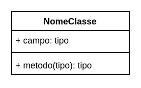
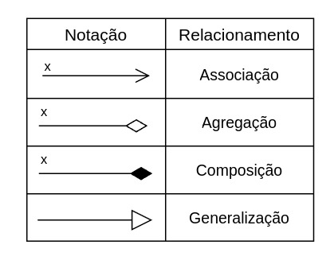
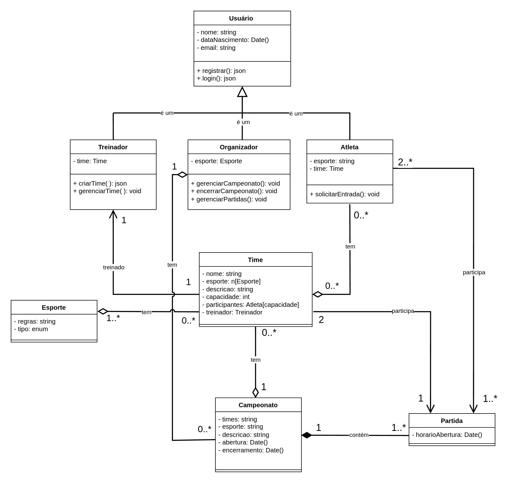

# Diagrama de Classe

## Introdução

O diagrama de classe é um dos principais diagramas da **UML (Unified Modeling Language)** e tem como objetivo representar a estrutura estática de um sistema orientado a objetos. Ele descreve **classes**, seus **atributos**, **métodos** e os **relacionamentos** entre elas, como herança, associação, agregação e composição. Essas representações ajudam a compreender como os diferentes elementos de um sistema estão conectados.

Esse tipo de diagrama é amplamente utilizado durante a análise e o design de software, pois oferece uma visão clara da arquitetura do sistema. Ele permite identificar **responsabilidades das classes**, **dependências** e possíveis melhorias antes da implementação, além de facilitar a comunicação entre os membros da equipe.

Algumas das principais vantagens de usar diagramas de classe incluem:

- **Visualização da arquitetura**: Ajuda a entender as interações e responsabilidades do sistema.
- **Planejamento eficiente**: Identifica inconsistências ou problemas antes do desenvolvimento.
- **Documentação do sistema**: Garante um registro claro da estrutura, essencial para manutenção futura.
- **Comunicação**: Facilita o alinhamento entre desenvolvedores, analistas e stakeholders.

## Metodologia

## Notações do Diagrama de Classes

### Classe

As classes são os principais elementos do Diagrama de Classes e representam os objetos do sistema. Elas são representadas por um retângulo dividido em três seções: a primeira contém o nome da classe, a segunda contém os atributos e a terceira contém os métodos, conforme mostrado na Figura 1.

Figura 1: Notação - Classe 

Autores: [Flávio Melo](https://github.com/flavioovatsug) e [Fabrício](https://github.com/FabricioDeQueiroz)

### Relacionamentos

Os relacionamentos entre classes são representados por diferentes tipos de linhas/setas que conectam as classes envolvidas. Existem vários tipos de relacionamentos, como associação, agregação, composição e generalização. A Figura 2 mostra a notação para cada um desses relacionamentos.

Figura 2: Notação - Relacionamentos 

Autores: [Flávio Melo](https://github.com/flavioovatsug) e [Fabrício](https://github.com/FabricioDeQueiroz)

## Diagrama de Classes

A Figura 3 a seguir, apresenta o Diagrama de Classes da aplicação TorneioPro, criado pela equipe.

Figura 3: Diagrama de Classes 

Autores: [Flávio Melo](https://github.com/flavioovatsug), [Oscar de Brito](https://github.com/OscarDeBrito), [Italo Bruno](https://github.com/italobrunom), [Fabricio](https://github.com/FabricioDeQueiroz), [Gustavo França](https://github.com/gustavofbsy)  e [Yan Werlley](https://github.com/YanWerlley) 

## Conclusão

## Bibliografia

> 1. Serrano, Milene. Arquitetura E Desenho de Software AULA - Modelagem - Diagrama de Classe. Nov. 2024.
> 2. GILLEANES T A GUEDES. UML : uma abordagem prática. São Paulo: Novatec, 2008.

## Histórico de Versão

|Versão|Data|Descrição|Autor|Revisor| Detalhes da revisão |
|:----:|----|---------|-----|:-------:|-----| 
|  |  |  |  |  | |
| 1.1 | 26/11/2024 | Adicionando Notações do Diagrama de Classes e Correções | [Fabrício](https://github.com/FabricioDeQueiroz) e [Flávio Melo](https://github.com/flavioovatsug) |  | |