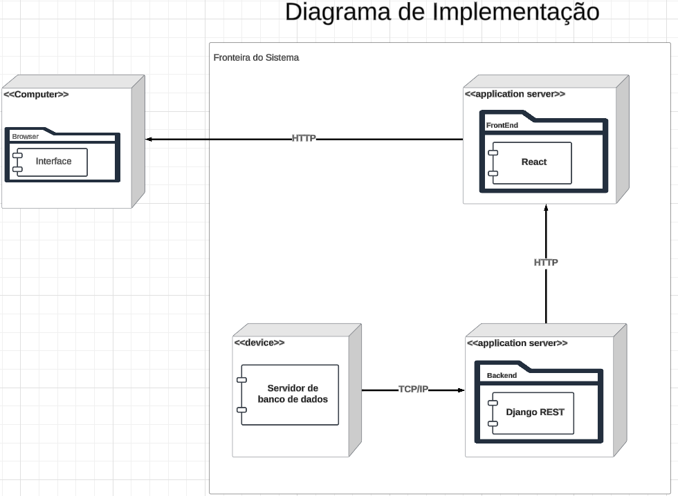

# Diagrama de Implantação

## Introdução ao Diagrama de Implantação

O diagrama de Implantação é uma ferramenta essencial utilizada para representar a arquitetura física de um sistema, detalhando como os componentes de software são implantados em elementos de hardware. Ele fornece uma visão clara de como os sistemas são estruturados e interconectados no ambiente operacional, incluindo servidores, dispositivos, redes e outros recursos físicos.

Esse tipo de diagrama desempenha um papel estratégico no desenvolvimento e manutenção de sistemas, pois documenta a distribuição dos artefatos de software, como executáveis, bibliotecas e bancos de dados, nos nós físicos que os suportam. Além disso, descreve as interações entre esses nós, evidenciando aspectos como conexões de rede, dependências e alocação de recursos.

## Objetivo

O objetivo do diagrama de Implantação é fornecer uma visão detalhada e organizada da topologia do ambiente onde o software será executado. Ele destaca a distribuição dos componentes de software nos nós físicos (estruturas com capacidade computacional) e as associações entre eles, facilitando a compreensão das conexões e interações entre os diferentes elementos da aplicação web.

Essa abordagem contribui para o alinhamento da equipe de desenvolvimento e demais envolvidos no projeto, promovendo uma visão clara e compartilhada de como os recursos de hardware e software serão integrados para suportar a aplicação.

## Diagrama - versão 1

Autores: [Christian](https://github.com/crstyhs), [Ian Lucca](https://github.com/IanLucca12), [Caio Sulz](https://github.com/CaioSulz), [Harryson Campos](https://github.com/harry-cmartin)

## Referências Bibliográgicas 

- Uml-diagrams.ors. Deployments Diagrams. Disponível em: <https://www.uml-diagrams.org/deployment-diagrams.html>. Acesso em: 24 nov. 2024. 

- Aprender 3 - Arquitetura de Software. Disponível em: <https://aprender3.unb.br/course/view.php?id=23388>. Acesso em: 24 nov. 2024.

## Histórico de Versão
|Versão|Data|Descrição|Autor|Revisor| Detalhes da revisão |
|:----:|----|---------|-----|:-------:| ----- |
|1.0| 22/11/2024 | Criação do Artefato |[Ian Lucca](https://github.com/IanLucca12)  | |
|1.1| 22/11/2024 | Adição do objetivo |[Christian](https://github.com/crstyhs)  | |
|1.2| 23/11/2024 | Adição do Diagrama |[Caio Sulz](https://github.com/CaioSulz)  | |
|1.3|27/11/2024|Correções e adição das referencias| [Harryson Campos](https://github.com/harry-cmartin)|
|1.4|27/11/2024|Correções | [Caio Sulz](https://github.com/CaioSulz)|
|1.5|28/11/2024|Correções no caminho de Assets e na imagem | [Caio Sulz](https://github.com/CaioSulz)|

