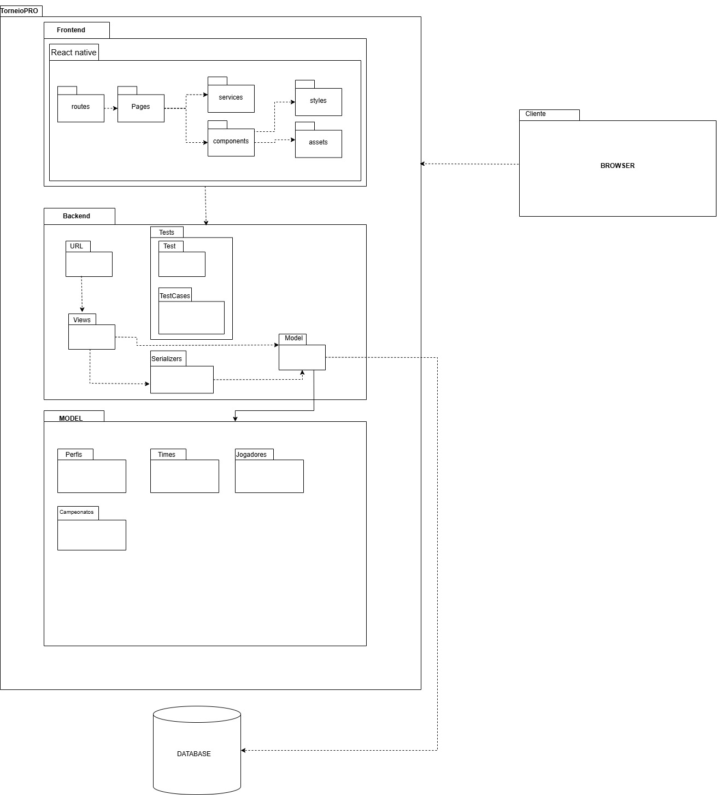

# Diagrama de Pacotes

## Introdução

Este documento apresenta o Diagrama de Pacotes do projeto TorneioPRO, um artefato essencial na modelagem e no planejamento do sistema. O diagrama é utilizado para ilustrar a organização modular do software, agrupando elementos relacionados em pacotes para simplificar a compreensão e promover a escalabilidade do projeto.

O objetivo deste documento é descrever a estrutura lógica do sistema, destacando as dependências e relações entre os diferentes pacotes, de forma a facilitar a comunicação entre as equipes de desenvolvimento, arquitetura e gestão do projeto. Além disso, este material serve como base para decisões estratégicas no design do sistema, promovendo a reutilização de componentes, modularidade e manutenção.

## Metodologia

O objetivo do diagrama de pacotes, no contexto metodológico, é organizar e estruturar os módulos do sistema com base nos princípios de design de software. Ele busca refletir a separação de responsabilidades, minimizar dependências entre os componentes e facilitar a implementação, manutenção e escalabilidade do sistema.

O diagrama foi desenvolvido de acordo com os Frameworks Django para o backend e React Native para o frontend, e utilizamos como pilares de construção os seguintes pontos:

- **Definição dos Pacotes Principais**

- **Identificação de Dependências**

## Diagrama

Figura 1: Notação - Pacotes 

Autores: [Caio Sulz](https://github.com/CaioSulz), [Christian](https://github.com/crstyhs), [Ian Lucca ](https://github.com/IanLucca12), [Harryson](https://github.com/harry-cmartin)

## Bibliografia

> 1. https://www.lucidchart.com/pages/pt/diagrama-de-pacotes-uml

> 2. DRAW.IO - Disponível em: https://app.diagrams.net/

## Histórico de Versão

|Versão|Data|Descrição|Autor|Revisor| Detalhes da revisão |
|:----:|----|---------|-----|:-------:|-----| 
|  |  |  |  |  | |
| 1.0 | 27/11/2024 | Criação do documento e Metodologia |[Caio Sulz](https://github.com/CaioSulz) |  | |
|1.1|27/11/2024| Complementando o documento |[Harryson](https://github.com/harry-cmartin)|
| 1.2 | 28/11/2024 | Correção no texto de metodologia |[Caio Sulz](https://github.com/CaioSulz) |

