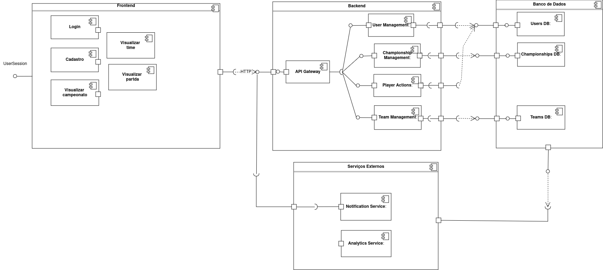

# 2.x Diagrama de Componentes

## Introdução

O Diagrama de Componentes é uma ferramenta essencial dentro da modelagem UML (Unified Modeling Language), utilizada para representar a arquitetura física de um sistema de software. Ele descreve como o sistema é dividido em partes modulares, chamadas componentes, que interagem entre si para atender aos requisitos funcionais e não funcionais.

Nesse projeto, o diagrama de componentes foi elaborado com o objetivo de ilustrar a estrutura do sistema de Gerenciamento de Campeonatos, detalhando as partes principais da aplicação e suas interações. 

## Metodologia
O squad 3 composto por [Artur Jackson](https://github.com/artur-jack), [Gabriel esteves](https://github.com/GabrielMEsteves), [Oscar de Brito](https://github.com/OscarDeBrito) e [Yan Luca Viana](https://github.com/yan-luca) se reuniu pelo Discord para discutir e definir os módulos do sistema.Utilizamos a ferramenta [draw.io](https://app.diagrams.net/) para a elaboração do Diagrama de Componentes, representando partes independentes do sistema, tendo como base vídeo aula da professora e de outros professores, pesquisas na internet além da documentação da notação UML.
## Diagrama de Componentes

O diagrama de componentes representa a arquitetura do sistema para gerenciamento de campeonatos de futebol. Ele está dividido em quatro partes principais:
1. **Frontend**: Interface que permite interação dos usuários com o sistema.
2. **Backend**: Responsável pela lógica de negócio e integração com o banco de dados.
3. **Banco de Dados**: Estruturas responsáveis por armazenar informações de usuários, times e campeonatos.
4. **Serviços Externos**: Serviços auxiliares para notificações e análises estatísticas.

 
 

# Frontend
O Frontend é a interface principal para os usuários do sistema. Ele fornece funcionalidades como login, cadastro e visualização de dados, conectando-se ao **API Gateway** para acessar os serviços do backend.

- **Login**:
  - **Descrição**: Permite que os usuários autentiquem-se no sistema.
  - **Conexão**: Envia requisições HTTP para o `User Management` via `API Gateway`.

- **Cadastro**:
  - **Descrição**: Realiza o registro de novos usuários.
  - **Conexão**: Similar ao Login, usa o `API Gateway`.

- **Visualizar Time/Partida/Campeonato**:
  - **Descrição**: Permite consultar informações sobre times, partidas e campeonatos.
  - **Conexão**: Consome dados fornecidos pelo `Championship Management` e `Team Management` via `API Gateway`.

## Fluxo
1. O usuário interage com o frontend.
2. O frontend envia requisições ao backend por meio do `API Gateway`.
3. As respostas são exibidas na interface.

 
 

# Backend

O Backend implementa a lógica de negócio do sistema. Ele processa requisições do Frontend e interage com o banco de dados para fornecer informações e executar operações.

- **API Gateway**:
  - **Descrição**: Centraliza requisições do Frontend e distribui para os serviços apropriados.
  - **Conexões**:
    - Recebe requisições HTTP do Frontend.
    - Encaminha para serviços internos como `User Management` e `Championship Management`.

- **User Management**:
  - **Descrição**: Gerencia autenticação e cadastro de usuários.
  - **Conexões**:
    - Com o `Users DB` para criar e autenticar usuários.

- **Championship Management**:
  - **Descrição**: Gerencia a criação e manutenção de campeonatos.
  - **Conexões**:
    - Com o `Championships DB` para salvar e recuperar dados de campeonatos.

- **Player Actions**:
  - **Descrição**: Processa ações dos jogadores, como solicitações para entrar em times.
  - **Conexões**:
    - Com o `Team Management` para validar solicitações.

- **Team Management**:
  - **Descrição**: Gerencia os times e associações de jogadores.
  - **Conexões**:
    - Com o `Teams DB`.

## Fluxo
1. O `API Gateway` recebe requisições do Frontend.
2. Distribui para os componentes adequados.
3. Os componentes acessam o banco de dados para persistir ou recuperar dados.
4. As respostas são enviadas de volta ao Frontend.

 
 

# Banco de Dados

O banco de dados armazena informações essenciais para o sistema, como dados de usuários, times e campeonatos.

## Estrutura
- **Users DB**:
  - Armazena informações de usuários.
  - Conectado ao `User Management`e `Player actions `.

- **Championships DB**:
  - Armazena informações de campeonatos.
  - Conectado ao `Championship Management`.

- **Teams DB**:
  - Armazena dados de times e associações de jogadores.
  - Conectado ao `Team Management`.

  
 
 

# Serviços Externos

## Notification Service
- **Descrição**: Envia notificações baseadas em eventos do backend.
- **Conexões**:
  - Recebe dados de eventos do componentes do backend.

## Analytics Service
- **Descrição**: Gera estatísticas com base nos dados do banco de dados.
- **Conexões**:
  - Acessa diretamente o SGBD para gerar relatórios.

## Fluxo
1. O Notification Service é acionado por eventos do backend.
2. O Analytics Service consulta os bancos de dados para gerar estatísticas e relatórios.

## Fluxo
1. O Notification Service é acionado por eventos do backend.
2. O Analytics Service consulta os bancos de dados para gerar estatísticas e relatórios.

Tabela 1: Diagrama de Componentes 

 

Autores: [Artur Jackson](https://github.com/artur-jack), [Oscar de Brito](https://github.com/OscarDeBrito), [Gabriel esteves](https://github.com/GabrielMEsteves)  e [Yan Luca Viana](https://github.com/yan-luca) 

## Histórico de Versão

|Versão|Data|Descrição|Autor|Revisor| Detalhes da revisão |
|:----:|----|---------|-----|:-------:|-----| 
| 1.0 | 28/11/2024 | Criação do documento | [Squad 3](../../SubGrupo/squad3.md)|  | |
| 1.1 | 28/11/2024 | Inserção do Diagrama e documentação | [Squad 3](../../SubGrupo/squad3.md)|  | |
