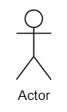
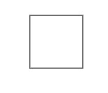
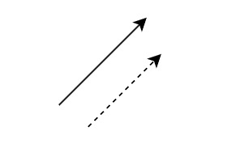
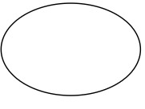
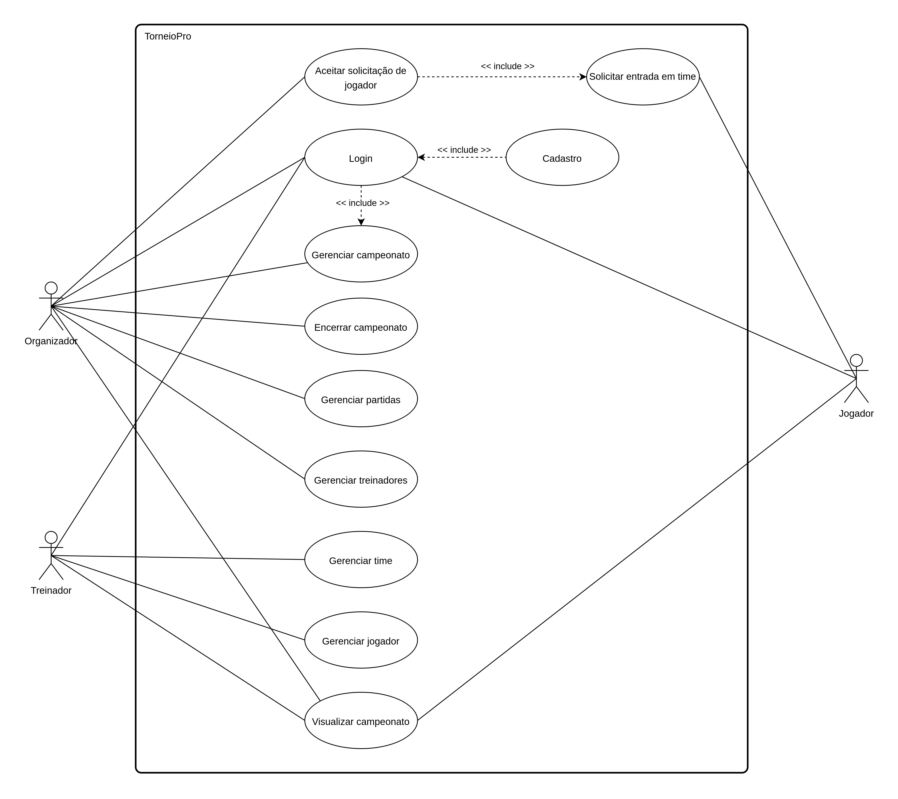

# Casos de Uso

## Introdução

O diagrama de casos de uso é uma representação gráfica utilizada para descrever as funcionalidades de um sistema sob a perspectiva de seus usuários finais (atores). Baseado na UML, esse diagrama destaca as interações entre os atores e os casos de uso, que representam as principais ações do sistema. Ele é amplamente utilizado na fase de levantamento de requisitos, pois facilita a comunicação entre analistas, desenvolvedores e stakeholders, garantindo que as funcionalidades sejam compreendidas e atendam às necessidades do projeto. Além disso, sua simplicidade e objetividade tornam-no uma ferramenta essencial para alinhar expectativas e planejar o desenvolvimento de sistemas eficazes.

## Metodologia
O diagrama de caso de uso é uma representação visual que sintetiza as interações entre os usuários e o sistema. Para definir os casos de uso do nosso sistema, realizamos uma reunião no Discord, durante a qual analisamos detalhadamente as funcionalidades previstas para o nosso site. Essa abordagem nos permitiu identificar cenários realistas de uso, mapeando as principais funcionalidades e as interações entre os usuários e o sistema que estamos desenvolvendo. Como resultado, conseguimos uma visão clara e organizada dos requisitos, o que facilitará a implementação.

Tabela 1: Elementos usados no diagrama de casos de uso 

| Nome           |Descrição                     |    Representação                           |
|----------------|------------------------------|--------------------------------------------|
| Ator           | Entidade externa que interage com o sistema, podendo ser um usuário ou outro sistema. No nosso caso, utilizamos quatro atores, organizador, treinador, jogador e o próprio sistema. |  |
|Retângulo | Representação do sistema por inteiro ||
|Seta| Representações das interações entre atores e usos no sistema||
|Elipse|Representação dos casos de uso. Um caso de uso mostra uma funcionalidade ou ação a ser realizada dentro do sistema.||

Autor: [Flávio Melo](https://github.com/flavioovatsug)

## Diagrama de Casos de Uso

Figura 1: Diagrama de Casos de Uso

Autor: [Squad 2]([Squad2](../../SubGrupo/squad2.md)
) e [Squad 3](../../SubGrupo/squad3.md)

## Casos de Uso

Tabela 1: 

| UC01 |  Gerenciar Campeonato |
| -: | :- |
| **Atores** | Organizador |
| **Funcionalidade** | O organizador pode criar e gerenciar campeonatos |
| **Pré-condições** | <uii><li> Conexão com a internet </li><li> Login no sistema como organizador |
| **Ação** | O Organizador gerencia o campeonato, podendo visualizar, cadastrar, editar ou excluir informações relacionadas.  |
| **Fluxo básico** | <ul><li> O usuário acessa o aplicativo como organizador.   </li><li> O organizador acessa os campeonatos.   </li><li> O sistema exibe a lista de campeonatos.   </li><li> O organizador pode realizar uma das ações disponíveis no gerenciamento de jogadores: Criar, Visualizar, Editar e Excluir   |
| **Fluxos alternativos** | <ul><li>O organizador acessa a funcionalidade de campeonatos. </li><li>O sistema exibe uma mensagem informando "Nenhum campeonato encontrado". </li><li>O sistema apresenta a opção "Criar campeonato".  </li><li>O organizador clica na opção "Criar campeonato".  </li><li>O sistema exibe o formulário de criação de campeonato.  </li><li>O organizador insere os dados obrigatórios e confirma a criação.  </li><li>O sistema salva o novo campeonato no banco de dados e exibe a lista de campeonatos atualizada.</li></ul> |
| **Fluxos de exceção** | <ul><li> O usuário acessa o aplicativo como organizador.   <ul><li> O organizador cria um campeonato sem colocar nenhum dado  </li><li>O sistema exibe uma mensagem indicando "Faltam informações obrigatórias."   |
| **Pós-condições** |<ul><li> POS01. As alterações feitas no gerenciamento de campeonato são salvas no banco de dados  |
| **Data da criação** | 23/11/2024 |
| **Rastreabilidade** | |

Autor: [Italo Bruno](https://github.com/ItaloBrunoM)  .

Tabela 2: 

| UC02 |  Gerenciar Jogador |
| -: | :- |
| **Atores** | Treinador |
| **Funcionalidade** | O treinador de um time pode gerenciar os jogadores do seu time |
| **Pré-condições** | <ui><li> Conexão com a internet </li><li> Login no sistema com o perfil de treinador </li><li> Treinador deve estar associado a pelo menos um time no sistema |
| **Ação** | O treinador gerencia seus jogadores, podendo visualizar, cadastrar, editar ou excluir informações relacionadas a eles.  |
| **Fluxo básico** | <ul><li> O usuário acessa o aplicativo como treinador.   </li><li> O treinador acessa seu time.   </li><li> O sistema exibe a lista de jogadores associados ao time e informações do time.   </li><ul> Excluir jogador (FA01)   </ul><ul> Editar jogador (FA2)   </ul><ul> visualizar detalhes do jogador (FA03) </ul> <li> O treinador pode clicar no botão de adicionar um novo jogador.  <li>O sistema mostra as informações necessárias a serem preenchidas.</li><li>O treinador preenche as informações.</li><li>O sistema valida as informações.</li></li>
| **Fluxos alternativos** | <ul><li>**FA01 – Excluir Jogador**<ul><li>O treinador seleciona o ícone de lixeira.</li><li>O sistema exige a confirmação da ação de excluir.</li><li>O treinador confirma a exclusão clicando em "deletar".</li><li>O sistema exclui o jogador.</li><li>Fim do FA01.</li></ul></li><li>**FA02 – Editar jogador**<ul><li>O treinador seleciona o ícone de lápis.</li><li>O sistema mostra as informações necessárias a serem preenchidas.</li><li>O treinador preenche as informações.</li><li>O sistema valida as informações.</li><li>O sistema salva as informações do jogador.</li><li>Fim do FA02.</li></ul></li><li>**FA03 – Visualizar detalhes do jogador**<ul><li>O treinador seleciona o ícone de olho.</li><li>O sistema mostra as informações detalhadas do jogador.</li><li>Fim do FA03.</li></ul> |
| **Fluxos de exceção** | <ul><li> O treinador tenta acessar um time, mas ainda não possui times cadastrados   <ul><li> O sistema exibe uma mensagem informando que ele deve primeiro criar um time."  <ul><li> O treinador busca um jogador pelo nome, mas o jogador não está na lista  </ul><li>O sistema exibe uma mensagem indicando "Nenhum jogador encontrado."  |
| **Pós-condições** | <ul><li> As alterações feitas no gerenciamento de jogadores são salvas no banco de dados  <ul><li> O treinador visualiza a lista atualizada de jogadores. |
| **Data da criação** | 23/11/2024 |
| **Rastreabilidade** | |

Autor: [Artur Jackson](https://github.com/artur-jack) e [Oscar Brito](https://github.com/OscarDeBrito).

Tabela 3: 

| UC03 |  Encerrar Campeonato |
| -: | :- |
| **Atores** | Organizador |
| **Funcionalidade** | O organizador pode encerrar campeonatos após sua conclusão |
| **Pré-condições** | <ui><li> Conexão com a internet   </li><li> Login no sistema como organizador   </li><li> Campeonato deve estar ativo |
| **Ação** | O Organizador encerra o campeonato, impedindo edições futuras e atualizando o status para encerrado.  |
| **Fluxo básico** | <ul><li> O organizador acessa o aplicativo como organizador.   </li><li> O organizador navega até a seção de campeonatos.   </li><li> O sistema exibe a lista de campeonatos ativos.   </li><li> O organizador seleciona o campeonato desejado e clica na opção "Encerrar Campeonato".   </li><li> O sistema solicita confirmação para encerrar.   </li><li> O organizador confirma a ação.   </li><li> O sistema atualiza o status do campeonato para "Encerrado" e impede edições futuras. |
| **Fluxos alternativos** | <ul><li> O organizador tenta acessar a funcionalidade de encerrar um campeonato que já está encerrado. <ul><li> O sistema não mostra a opção de encerrar  |
| **Fluxos de exceção** | <ul><li> O organizador tenta encerrar um campeonato, mas há pendências no sistema (ex.: resultados não cadastrados).   <ul><li> O sistema exibe uma mensagem indicando: "Não é possível encerrar o campeonato. Resolva as pendências antes de prosseguir."   |
| **Pós-condições** |<ul><li> POS01. O status do campeonato é atualizado para "Encerrado" no banco de dados.   <ul><li> POS02. O campeonato é exibido na lista de históricos encerrados. |
| **Data da criação** | 24/11/2024 |
| **Rastreabilidade** |  |

Autor: [Yan Werlley](https://github.com/YanWerlley).

Tabela x: 

| **UC01** | **Editar Partida** |
| -: | :- |
| *Atores* | Organizador |
| *Funcionalidade* | O organizador deve ser capaz de visualizar e alterar as partidas que estão em andamento |
| *Pré-condições* | <ui><li> Conexão com a internet  </li><li> Login no sistema como organizador |
| *Ação* | O organizador analisa as partidas |
| *Fluxo básico* | <ul><li>O organizador acessa o sistema. </li><li> O organizador realiza o login". </li><li>Após realizar o login, o organizador clica na opção "Campeonatos". </li><li> Na tela de "Campeonatos", apresentará uma lista com todos os campeonatos disponíveis. </li><li> O organizador seleciona um campeonato para editar suas partidas. </li><li> O sistema apresenta todas as partidas programadas do campeonato selecionado. </li><li> O organizador seleciona a opção "Editar Partida". </li><li> O sistema mostra as informações necessárias a serem preenchidas. </li><li> O organizador preenche as informações. </li><li> O sistema valida as informações. </li><li> O sistema salva as novas informações daquela partida.  |
| *Fluxos alternativos* |   |
| *Fluxos de exceção* | <ul><li> FE01 - O organizador tenta editar uma partida mas não preenche informações obrigatórias   <ul><li> O sistema exibe uma mensagem indicando: "Não é possível editar a partida. Por favor, preencher todos os campos."   |
| *Pós-condições* | <ul><li>**POS01.** O time é editado e armazenado no banco. |
| *Data da criação* | 23/11/2024 |
| *Rastreabilidade* | |

Autor: [Gustavo França](https://github.com/gustavofbs), [Flávio Melo](https://github.com/flavioovatsug) e [Oscar Brito](https://github.com/OscarDeBrito) .

Tabela 4: Gerenciar Time

| **UC04** | **Gerenciar Time** |
|----------|--------------------|
| **Atores** | Treinador |
| **Funcionalidade** | O Treinador pode criar e mudar as características do time. |
| **Pré-condições** | <ui><li> Conexão com a internet  </li><li> Login no sistema como treinador |
| **Ação** | O treinador gerencia seus times, podendo visualizar, cadastrar, editar ou excluir informações relacionadas a eles. |
| **Fluxo básico** | <ul><li>O usuário acessa o app como treinador.</li><li>O treinador navega até a seção de times.</li><li>O sistema exibe a lista de times ativos do treinador.</li><li>O treinador seleciona a opção "Criar time".</li><li>Excluir Time (FA01).</li><li>Editar Time (FA02).</li><li>O sistema mostra as informações necessárias a serem preenchidas.</li><li>O treinador preenche as informações.</li><li>O sistema valida as informações.</li><li>O sistema salva as informações do time.</li></ul> |
| **Fluxos alternativos** | <ul><li>**FA01 – Excluir time**<ul><li>O treinador seleciona o ícone de lixeira.</li><li>O sistema exige a confirmação da ação de excluir.</li><li>O treinador confirma a exclusão clicando em "deletar".</li><li>O sistema exclui o time.</li><li>Fim do FA01.</li></ul></li><li>**FA02 – Editar time**<ul><li>O treinador seleciona o ícone de lápis.</li><li>O sistema mostra as informações necessárias a serem preenchidas.</li><li>O treinador preenche as informações.</li><li>O sistema valida as informações.</li><li>O sistema salva as informações do time.</li><li>Fim do FA02.</li></ul></li></ul></li><li>**FA03 – Visualizar detalhes do time**<ul><li>O treinador seleciona o ícone de olho.</li><li>O sistema mostra as informações detalhadas do jogador.</li><li>Fim do FA03.</li></ul> | |
| **Fluxos de exceção** | <ul><li>**FE01** - O treinador tenta criar um time mas não preenche informações obrigatórias<ul><li>O sistema exibe uma mensagem indicando: "Não é possível criar o time. Por favor, preencher todos os campos."</li></ul></li><li>**FE02** - O treinador tenta editar um time mas não preenche informações obrigatórias<ul><li>O sistema exibe uma mensagem indicando: "Não é possível editar o time. Por favor, preencher todos os campos."</li></ul></li></ul> |
| **Pós-condições** | <ul><li>**POS01.** O time é criado e armazenado no banco.</li><li>**POS02.** O time é excluido da base de dados (FA01) .</li><li>**POS03.** As informações do time são atualizadas (FA02)  |
| **Data da criação** | 24/11/2024 |
| **Rastreabilidade** | - | 

Autor: [Harryson Campos](https://github.com/harry-cmartin) e [Oscar Brito](https://github.com/OscarDeBrito).

Tabela 5: *Aceitar Solicitação de Jogador 

| **UC04** | **Aceitar Solicitação de Jogador** |
|----------|--------------------|
| **Atores** | Organizador |
| **Funcionalidade** | O organizador aceita uma solicitação de um jogador para ingressar em um time. |
| **Pré-condições** | <ui><li> Conexão com a internet  </li><li> Login no sistema como organizador </li><li> O jogador já deve estar cadastrado no sistema. </li><li> O jogador deve ter solicitado entrada em um time. |
| **Ação** | O organizador gerencia as solicitações dos jogadores aos times, podendo aceitá-las ou recusá-las |
| **Fluxo básico** | <ul><li> O organizador acessa o sistema. </li><li>O organizador realiza login. </li><li>O organizador acessa a funcionalidade "Gerenciar times".</li><li>O sistema apresenta uma lista de solicitações pendentes de jogadores.</li><li>O organizador seleciona uma solicitação para revisão.</li><li>O sistema exibe os detalhes da solicitação do jogador.</li><li>O organizador aceita a solicitação.</li><li> Recusar Solicitação (FA01).  </li><li>O sistema atualiza o status do jogador como membro do time. |
| **Fluxos alternativos** | <ul><li>**FA01 – Recusar Solicitação**<ul><li>Em vez de aceitar a solicitação, o organizador opta por rejeitá-la.</li><li>Fim do FA01.</li></ul> |
| **Fluxos de exceção** |  |
| **Pós-condições** | <ul><li>**POS01.** O jogador é adicionado ao time selecionado.</li><li>**POS02.** O sistema atualiza a lista de solicitações pendentes.  |
| **Data da criação** | 28/11/2024 |
| **Rastreabilidade** |  | 

Autor: [Gustavo França](https://github.com/gustavofbs) e [Yan Werlley](https://github.com/YanWerlley).

Tabela 5: UC05 - Solicitar Entrada em Time

| **UC05** |  **Solicitar Entrada em Time** |
| -: | :- |
| **Atores** | Jogador |
| **Funcionalidade** | O Jogador pode solicitar a entrada em um Time de um Campeonato existente. |
| **Pré-condições** | <ui><li> Conexão com a internet   </li><li> Existir Campeonato ativo e para data futura   </li><li> Estar em posse dos dados pessoais para cadastro |
| **Ação** | O Jogador visualiza os Campeonatos marcados para acontecer futuramente, e solicita entrada em uma Equipe do Campeonato.  |
| **Fluxo básico** | <ul><li> O Jogador acessa a página inicial da aplicação como usuário comum.   <li> No carrossel de Campeonatos Futuros, o Jogador seleciona o botão "Pedir para Participar" do Campeonato desejado.   <li> O sistema exibe os detalhes do Campeonato selecionado, juntamente com um formulário.   <li> O Jogador cadastra seus dados no formulário.   <li> O Jogador seleciona um Time, caso desejar.   <li> O Jogador aperta o botão "Solicitar Entrada", que enviará essa solicitação para o Organizador do evento, caso não tenha escolhido um Time, ou para o Treinador do Time que ele escolheu.   <li> Após ser aceito, o Jogador recebe um email com os dados para acessar a plataforma como um usuário Jogador. |
| **Fluxos alternativos** | - |
| **Fluxos de exceção** | <ul><li> **FE01.** O Jogador tenta solicitar entrada sem fornecer seus dados, ou fornece dados inválidos.   <ul><li> O sistema exibe uma mensagem indicando: "Não é possível Solicitar entrada no Campeonato. Dados inválidos ou não fornecidos."   |
| **Pós-condições** |<ul><li> **POS01.** O Jogador é inserido no Time solicitado, ou no Campeonato solicitado.   <li> **POS02.** O Jogador não é aceito e recebe um email informando que não foi aceito. |
| **Data da criação** | 24/11/2024 |
| **Rastreabilidade** | - |

Autor: [Fabrício de Queiroz](https://github.com/FabricioDeQueiroz).

Tabela 6: UC06 - Realizar Login

| **UC06** |  **Login** |
| -: | :- |
| **Atores** | Usuário |
| **Funcionalidade** | O usuário poderá acessar o sistema utilizando cadastro feito previamente. |
| **Pré-condições** | <ui><li> Conexão com a internet   </li><li> Estar na página de login   </li><li> Estar em posse dos dados pessoais cadastrados (login e senha)  |
| **Ação** | O usuário realiza o Login para acessar as funcionalidades do sistema.  |
| **Fluxo básico** | <ul><li> O usuário acessa o sistema.   <li> O usuário seleciona a opção de "Entrar".   <li> O sistema exibe os campos de preenchimento de login e senha.   <li> O usuário insere as informações de acordo com oque foi cadastrado.   <li> O sistema redireciona para a tela inicial de usuário. |
| **Fluxos alternativos** | <ul><li>**FA01 – Esquecer a Senha**<ul><li>O usuário clica na opção de "Esqueceu a senha?".</li><li>É redirecionado para uma página de recuperação de senha.</li><li>O usuário digita o e-mail cadastrado e clica para enviar a recuperação de senha.</li><li>Ao acessar o seu e-mail cadastrado, o usuário acessa a mensagem de recuperação de senha enviada, e clica no link.</li><li> Ao acessar a página, o usuário digita a senha nova e sua respectiva confirmação, e após clicar em redefinir, aparece a mensagem de confirmação da ação realizada.</li></ul>|
| **Fluxos de exceção** | <ul><li> **FE01.** O usário tenta realizar o login sem estar cadastrado.   <ul><li> O sistema exibe uma mensagem indicando: "Não é possível realizar Login. Dados inválidos ou usuário não cadastrado."   |
| **Pós-condições** |<ul><li> **POS01.** O usuário poderá acessar as funcionalidades disponíveis de acordo com seu cadastro(Jogador, Treinador, Organizador)   |
| **Data da criação** | 26/11/2024 |
| **Rastreabilidade** | - |

Autores: [Yan Luca Viana](https://github.com/yan-luca), [Gabriel Esteves](https://github.com/GabrielMEsteves). 

Tabela 7 : UC07 - Visualizar Campeonato

| **UC07** |  **Visualizar Campeonato** |
| -: | :- |
| **Atores** | Jogador, Treinador |
| **Funcionalidade** | O usuário poderá visualizar informações dos campeonatos disponíveis. |
| **Pré-condições** | - Conexão com a internet   - Login no sistema   - Acessar a aba "Campeonatos" |
| **Ação** | O usuário acessa a aba "campeonatos" como treinador ou jogador, para visualizar os campeonato disponíveis.  |
| **Fluxo básico** | <ul><li> O usuário acessa o sistema.   <li> O usuário realiza o login".   <li> Após realizar o login na página inicial de usuário, clica na opção "campeonatos".   <li> Na tela de "Campeonatos", apresentará uma lista com todos os campeonatos disponíveis.</li><li> O usuário seleciona um campeonato para visualizar suas informações. <li> O sistema apresenta as informações do campeonato selecionado.</ul> |
| **Fluxos alternativos** | - |
| **Fluxos de exceção** | - |
| **Pós-condições** |<ul><li> **POS01.** O usuário poderá Solicitar Inscrição em um campeonato (UC##)  |
| **Data da criação** | 26/11/2024 |
| **Rastreabilidade** | - |

Autores: [Yan Luca Viana](https://github.com/yan-luca), [Gabriel Esteves](https://github.com/GabrielMEsteves). 

## Bibliografia

SILVA, M. R. Análise e Projeto Orientado a Objetos com UML. 2ª ed. São Paulo: Atlas, 2013.
LUCIDCHART. Diagrama de Caso de Uso UML: Guia Completo. Disponível em: https://www.lucidchart.com/pages/pt/diagrama-de-caso-de-uso-uml.

## Histórico de Versão

|Versão|Data|Descrição|Autor|Revisor| Detalhes da revisão |
|:----:|----|---------|-----|:-------:|-----| 
| 1.0 | 27/11/2024 | Criação do documento com a inserção de casos de uso | [Squad 1](../../SubGrupo/squad1.md), [Squad 2](../../SubGrupo/squad2.md) e [Squad 3](../../SubGrupo/squad3.md) |  | |
| 1.1 | 27/11/2024 | Adiciona o caso de uso "Editar Partida" e corrige a formatação dos demais | [Flávio Melo](https://github.com/flavioovatsug), [Gustavo França](https://github.com/gustavofbs) e [Oscar Brito](https://github.com/OscarDeBrito) |  | |
| 1.2 | 27/11/2024 | Adiciona o caso de uso "Aceitar Solicitação de Jogador" | [Gustavo França](https://github.com/gustavofbs), [Flávio Melo](https://github.com/flavioovatsug) e [Yan Werlley](https://github.com/YanWerlley) |  | |